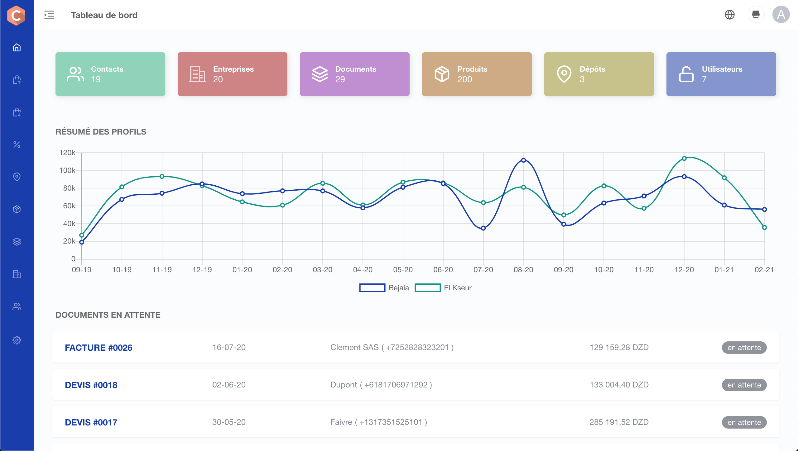

# Compass
Stock management and invoincing app build on Laravel, VueJS 2, ElementUI.



NOTE: This project was not updated since mid-2021, do not use for production, only for inspiration and education purposes. 

- Clients and providers
- Products and categories
- Quotations and invoices creation and printing
- Stock management
- Dashboard
- Users and roles

## Requirements

- PHP 7.2.*
- Mysql/Postgres
- Composer
- Nodejs - Yarn or npm

## Installing

```bash
# clone this repo

# Migration and seed DB
php artisan migrate --seed

# Install dependencies
yarn install

# dev
yarn dev # or npm run watch

# Build on production
yarn production
```
